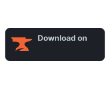

# Badges

This repository houses logos, button and shields for various minecraft-related websites to enhance your README.md pages!

It also features a supported version display that can be embedded on Curse Forge, Modrinth and GitHub.

# Logos, Buttons and Shields

## Modrinth
Assets ranging from logos to buttons can be found at https://github.com/modrinth/art

### Button

Example button for github:

<a href="https://modrinth.com/resourcepack/better-flame-particles/versions">
<picture>
  <source media="(prefers-color-scheme: dark)" srcset="https://raw.githubusercontent.com/modrinth/art/main/Branding/Badge/badge-dark.svg">
  <source media="(prefers-color-scheme: light)" srcset="https://raw.githubusercontent.com/modrinth/art/main/Branding/Badge/badge-light.svg">
  
</picture>
</a>

Code:
```markdown
<a href="https://modrinth.com/resourcepack/better-flame-particles/versions">
<picture>
  <source media="(prefers-color-scheme: dark)" srcset="https://raw.githubusercontent.com/modrinth/art/main/Branding/Badge/badge-dark.svg">
  <source media="(prefers-color-scheme: light)" srcset="https://raw.githubusercontent.com/modrinth/art/main/Branding/Badge/badge-light.svg">
  
</picture>
</a>
```

### Shield

https://shields.io/ covers modrinth by default.

Example shield:


Code:

```markdown

```

## Curse Forge

No official asset repository

### Logo

Logo is unusable for inbeds

[Custom made dark mode responsive logo](/curseforge.svg):


Code:

```markdown

```

### Button

[Custom made button](assets/curseforge-badge-dark.svg):

<a href="https://www.curseforge.com/minecraft/texture-packs/better-flame-particles">
<picture>
  <source media="(prefers-color-scheme: dark)" srcset="assets/curseforge-badge-dark.svg">
  <source media="(prefers-color-scheme: light)" srcset="assets/curseforge-badge-light.svg">
  
</picture>
</a>

Code:
```markdown
<a href="https://www.curseforge.com/minecraft/texture-packs/better-flame-particles">
<picture>
  <source media="(prefers-color-scheme: dark)" srcset="assets/curseforge-badge-dark.svg">
  <source media="(prefers-color-scheme: light)" srcset="assets/curseforge-badge-light.svg">
  
</picture>
</a>
```

### Shield - Not updating anymore since Curse Forge website overhaul

Custom shield service for Curse Forge: https://cf.way2muchnoise.eu/

Example shield:


Code:
```markdown

```

## Planet Minecraft

### Logo

https://www.planetminecraft.com/images/layout/favicon-128.png


Code:
```markdown

```

### Button

No button available yet

### Shield

No shield service exits that I know of. Made a [custom PHP file](/endpoint.php) to create an endpoint that can be used in shields.io (This file needs to be hosted on your own webserver with php installed)

Example shield:


Code:
```markdown
?project=texture-pack/better-flame-particles">
```

project= defines the url slug for the project e.g. for planetminecraft.com/texture-pack/better-flame-particles/, it's texture-pack/better-flame-particles. Make sure to actually encode the URL to the hosted PHP file. For better configuration, use [the already available documentation on shields.io for endpoints](https://shields.io/endpoint).

### Alternative shield

If you don't want to use the endpoint solution, you can also directly embed [this custom PHP file](/badge.php).

Example shield:


Code:
```markdown
?project=texture-pack/better-flame-particles&style=for-the-badge&logo=data:image/webp;base64,UklGRmYBAABXRUJQVlA4TFoBAAAvP8APEJ/AJgCANDjcRHDt34QCWoH5aqgJAKQBbtzb/k3sYgGvraJIkpq5E3C60M+fbwYBmfkPAPj/78kRNnPJKxVqPkwCMQgq/I1Morbke9f/cc5p9Qji1EawYTDAtm2rakNT77bBxv//Wo6Hg5q2j2tH9H8CUvArNJ36d9a5F2d2dt53ki+UOVUHLOZ6PGmVNA3mKClDf9iVdzcdvi/FAHe2mh/OKOA0envTquspCFwvcwECTMv7VW5ST2f+F6y1Uzm4R0lWLv+5hsrR6erLWxqkSw3m9aqvMlYPkp6msemeJF1PukoGrvIwX8BsZtMzmE8gm1u5Q8en6cnADJyFgxS0OhvwKBL4gJlTpVsAfMxA3XdMchqbmc2lPoO8b+rncmpS7u4+dPfKvBOukW6Fqk1Ss1R9shQp/37YHe8gdwgxHOw1Kfg8qWEEBKQz1u1GOvENBJ+JGIIB">
```

project= defines the url slug for the project (for https://planetminecraft.com/texture-pack/better-flame-particles/, it will be texture-pack/better-flame-particles)<br>
style= uses the same format as the https://shields.io/ website.<br>
logo= defines a converted planetminecraft logo


# Supported versions display

[This PHP file](/supported/supported.php) creates a image that displays the supported Minecraft versions for your project.
Make sure to include all assets in the subdirectory if you want to host and use it.

untested_versions= defines a range of versions that have not yet been tested. A question mark will appear.<br>
supported_versions= defines a range of versions that are supported. If the progress bar is enabled it will get filled. If icons are enabled, a green checkmark will appear.<br>
total_versions= defines a range of versions that should be displayed. Any version not specified here will not get shown.<br>
icons= defines whether icons are shown or not. (true/false)<br>
desaturated_icons= defines whether icons should use their desaturated version or not. (true/false)<br>
progress_bar= defines whether a Minecraft-styled progress bar is shown. (true/false)<br>
mc_background= defines whether a Minecraft button will be used as the background. (true/false)<br>
platform= defines a platform where this image will be displayed. based on this information the background color will take on the exact color value of the dark mode version of the specified platform. (modrinth/curseforge/none)

Example:


Code:
```markdown
?untested_versions=1.20&supported_versions=1.17,1.18,1.19&total_versions=1.13,1.14,1.15,1.16,1.17,1.18,1.19,1.20&icons=true&white_mode=false">
```
